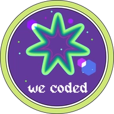
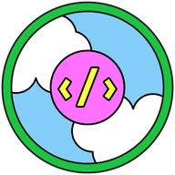

<h1 align="center">Hi 👋, I'm Gülnur Kozak 🦹‍♀️</h1>  
<h3 align="center">☁️ Full Stack Developer from Turkey 🌍</h3>

  
  
  

---

* 🔭 Currently working at [Türk Telekom](https://www.turktelekom.com.tr/en)
* 🌱 Learning **Angular, React, Golang, and Cloud Platforms**
* 🖥️ Contributing to [BulutBilisimciler](https://bulutbilisimciler.com/en)
* 📝 Writing on [Medium](https://medium.com/@g.altan.altan) about tech and ideas
* 🎨 Experimenting with creative UI designs on [CodePen](https://codepen.io/G-lnur-ALTAN)
* 📫 Reach me at **g.altan.altan@gmail.com**
---

<h3 align="left">Connect with me:</h3>

  
  
  
  
  

---

<h3 align="left">Languages and Tools:</h3>

  
  
  
  
  
  
  
  
  
  
  
  

---
<h3 align="left">🎊 Dev Community Badges</h2>

 
    
    
    
    

---
<h3 align="left">🂱 DevCard</h2>

 

---

